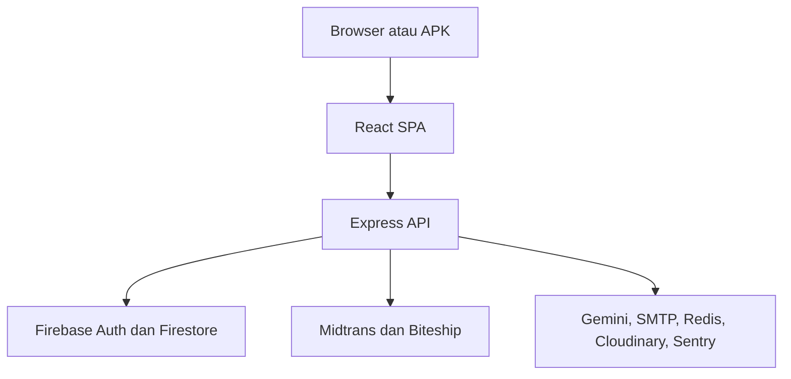

<div align="center">
  

# Morgen Geschäft

**Storefront e-commerce bilingual dengan pembayaran, pengiriman, loyalty, referral, chatbot AI, retur, dan panel administrasi.**

[Website](https://morgengeschaft.com/id) · [English](https://morgengeschaft.com/en) · [Dokumentasi lengkap](./docs/README.md) · [Changelog](./CHANGELOG.md) · [Lisensi MIT](./LICENSE)
</div>

---

## Tentang project

Morgen Geschäft adalah aplikasi e-commerce full-stack untuk penjualan produk
perawatan diri. Project ini menggabungkan website pelanggan, panel admin, API
backend, database, pembayaran, pengiriman, akun pelanggan, konten, notifikasi,
serta distribusi aplikasi Android melalui satu sistem.

Project mendukung Bahasa Indonesia dan English, checkout dengan atau tanpa akun,
pengelolaan toko melalui panel admin, serta integrasi layanan production seperti
Midtrans, Biteship, Firebase, Gemini, SMTP, Upstash Redis, Cloudinary, dan
Sentry.

> Repository ini berisi source website dan backend. Source aplikasi Android
> native/Expo tidak termasuk di dalam repository website ini.

## Fitur utama

### Pelanggan

- Storefront dan rute bilingual Indonesia/English.
- Katalog, kategori, pencarian, detail produk, galeri, dan rekomendasi.
- Informasi produk seperti bahan aktif, BPOM, isi bersih, batch, kedaluwarsa,
  dan peringatan jika datanya tersedia.
- Keranjang, wishlist, dan produk terakhir dilihat.
- Checkout tamu maupun pelanggan terdaftar.
- Kupon, flash sale, loyalty points, dan referral.
- Pembayaran melalui Midtrans.
- Pencarian area, tarif, kurir, dan tracking melalui Biteship.
- Login pelanggan tanpa password menggunakan OTP email.
- Riwayat pesanan, alamat tersimpan, dan fitur beli lagi.
- Lacak pesanan dan pembatalan sesuai status.
- Komplain dan retur dengan foto bukti serta riwayat penyelesaian.
- Ulasan produk, foto ulasan, dan tombol membantu.
- Inbox notifikasi, browser push, dan notifikasi stok.
- Artikel, FAQ, kebijakan privasi, dan syarat ketentuan.
- Kuis tipe kulit non-diagnostik.
- GESA, chatbot customer service berbasis Gemini.
- Download APK Android dari website.

### Admin

- Dashboard KPI dengan periode cepat dan rentang tanggal khusus.
- Pemantauan pesanan, stok menipis, dan kesehatan layanan.
- Feature flags untuk menonaktifkan fitur tanpa deploy.
- Pengelolaan produk bilingual, stok, harga, gambar, arsip, dan QR produk.
- Pengelolaan pesanan, status, resi, invoice PDF, catatan, dan ekspor CSV.
- Workflow komplain, retur, penggantian barang, dan refund.
- Pengaturan origin dan informasi pengiriman.
- Kupon dan flash sale terjadwal.
- Artikel bilingual dengan draft, preview, jadwal, dan publikasi.
- Moderasi ulasan.
- Broadcast notifikasi ID/EN.
- Pemantauan permintaan notifikasi stok.
- Backup JSON serta reset produk bawaan.
- Firebase custom claim dan MFA/TOTP admin.

## Teknologi

| Bagian            | Teknologi                                    |
| ----------------- | -------------------------------------------- |
| Frontend          | React 18, Vite 5, React Router, Tailwind CSS |
| Backend           | Node.js 22+, Express 4                       |
| Database          | Cloud Firestore                              |
| Authentication    | Firebase Authentication                      |
| Pembayaran        | Midtrans                                     |
| Pengiriman        | Biteship                                     |
| Chatbot AI        | Gemini                                       |
| Rate limiting     | Upstash Redis REST                           |
| Media             | Cloudinary dengan fallback local storage     |
| Email dan invoice | SMTP, Nodemailer, PDFKit                     |
| Push notification | Web Push dan VAPID                           |
| Monitoring        | Sentry dan health endpoint                   |
| Testing           | Node Test Runner, Vitest, Testing Library    |
| CI                | GitHub Actions                               |

## Arsitektur



Pada deployment satu domain, Express melayani endpoint /api sekaligus file
frontend production. Pada development, frontend Vite dan backend Express dapat
dijalankan terpisah.

## Struktur repository

```text
.
├── .github/                 # CI dan Dependabot
├── backend/                 # Express API, services, routes, dan tests
├── docs/
│   └── README.md            # Dokumentasi teknis dan penggunaan lengkap
├── firebase/                # Firestore rules dan indexes
├── frontend/                # React SPA
├── infra/                   # Script backup dan monitoring
├── scripts/                 # Audit, build, verifikasi, dan deployment
├── package.json             # Workspace dan perintah utama
└── README.md                # Halaman depan repository
```

## Persyaratan

- Node.js 22 LTS atau versi kompatibel.
- npm.
- Project Firebase dengan Authentication dan Firestore.
- Browser modern.

Integrasi seperti Midtrans, Biteship, Gemini, SMTP, Redis, Cloudinary, Web Push,
dan Sentry membutuhkan akun serta konfigurasi masing-masing.

## Menjalankan secara lokal

Clone repository dan instal dependency:

```bash
git clone <repository-url>
cd <repository-folder>
npm ci
```

Salin file environment:

```bash
cp frontend/.env.example frontend/.env.local
cp backend/.env.example backend/.env
```

Pada PowerShell:

```powershell
Copy-Item frontend/.env.example frontend/.env.local
Copy-Item backend/.env.example backend/.env
```

Isi environment yang dibutuhkan, lalu jalankan frontend dan backend:

```bash
npm run dev:full
```

Atau jalankan terpisah:

```bash
npm run dev:frontend
npm run dev:backend
```

Default development:

| Komponen    | Alamat                |
| ----------- | --------------------- |
| Frontend    | http://localhost:5173 |
| Backend API | http://localhost:3002 |

## Environment

Jangan commit file environment, service-account JSON, token, atau API key.

Kelompok konfigurasi utama:

- Firebase client config pada frontend/.env.local.
- Firebase Admin service account pada backend.
- Midtrans server/client key.
- Biteship API key dan webhook secret.
- Customer auth dan shipping quote secret.
- Gemini API key.
- SMTP.
- Upstash Redis.
- Cloudinary.
- VAPID.
- Sentry.

Daftar seluruh variable dan penjelasannya tersedia pada
[dokumentasi environment](./docs/README.md#8-konfigurasi-environment).

## Firebase dan admin

Deploy Firestore rules dan indexes:

```bash
npm run firebase:login
npm run firebase:status
npm run firebase:deploy
```

Berikan hak admin:

```bash
npm run admin:grant -- admin@example.com
```

Cabut hak admin:

```bash
npm run admin:revoke -- admin@example.com
```

Periksa kesiapan MFA:

```bash
npm run admin:mfa -- doctor admin@example.com
```

Jangan mewajibkan MFA sebelum minimal satu admin berhasil melakukan enrollment
dan login dengan faktor kedua.

## Testing

Jalankan quality gate secara berurutan:

```bash
npm ci
npm run lint
npm run test:backend
npm run test:frontend
npm run build
npm run privacy:audit
```

## Build

Build frontend:

```bash
npm run build
```

Hasil build berada di frontend/dist.

Build untuk deployment satu domain:

```bash
npm run build:hosting
```

Artifact build, node_modules, log, backup, ZIP deployment, dan file environment
tidak boleh ikut commit.

## Isi repository

Repository publik mencakup:

- README.md, LICENSE, dan folder docs;
- folder assets untuk aset halaman repository;
- folder frontend, kecuali node_modules, dist, dan file environment lokal;
- folder backend, kecuali node_modules, public hasil build, storage runtime, dan
  file environment;
- folder firebase;
- folder scripts;
- folder infra yang berisi script backup dan monitoring;
- folder .github;
- package.json, package-lock.json, dan file konfigurasi project.

File berikut dikecualikan melalui `.gitignore`:

- .env, .env.local, atau environment production;
- service-account JSON, API key, token, dan password;
- node_modules;
- frontend/dist dan backend/public;
- log, backup, upload pelanggan, dan data runtime;
- ZIP deployment, APK, atau AAB;
- data pelanggan dan pesanan production.

File environment contoh tetap tersedia sebagai `.env.example` tanpa nilai
secret agar instalasi lokal dapat dikonfigurasi dengan aman.

## Dokumentasi

Dokumentasi lengkap berada pada:

**[docs/README.md](./docs/README.md)**

Dokumentasi tersebut mencakup fitur, penggunaan, arsitektur, konfigurasi,
integrasi, model data, API, keamanan, deployment, APK, backup, monitoring,
troubleshooting, dan kontribusi.

Dokumentasi menggunakan format Markdown dengan ekstensi .md. GitHub akan
merendernya menjadi halaman yang dapat dibaca langsung di browser.

## Keamanan

Kebijakan pelaporan kerentanan tersedia pada [SECURITY.md](./SECURITY.md).
Detail arsitektur dan kontrol keamanan tersedia pada
[dokumentasi keamanan](./docs/README.md#15-keamanan).

## Kontribusi

Kontribusi dapat dilakukan melalui fork dan pull request:

1. Buat branch yang fokus pada satu perubahan.
2. Tambahkan atau perbarui test.
3. Jalankan lint, test, build, dan privacy audit.
4. Pastikan UI publik tetap tersedia dalam ID dan EN.
5. Jangan mengirim secret, data pelanggan, atau artifact build.
6. Jelaskan dampak perubahan dan cara mengujinya pada pull request.

Panduan lengkap tersedia pada
[bagian kontribusi](./docs/README.md#21-kontribusi).
Setiap contributor mengikuti [Code of Conduct](./CODE_OF_CONDUCT.md).

## Lisensi

Project ini dirilis menggunakan **MIT License**. Source boleh digunakan,
dipelajari, dimodifikasi, dan didistribusikan, termasuk untuk penggunaan
komersial, dengan tetap menyertakan pemberitahuan hak cipta dan lisensi.

Lihat [LICENSE](./LICENSE) untuk teks lisensi lengkap.

---

<div align="center">
  <sub>Morgen Geschäft · Dibangun untuk pengalaman belanja yang terintegrasi.</sub>
</div>
