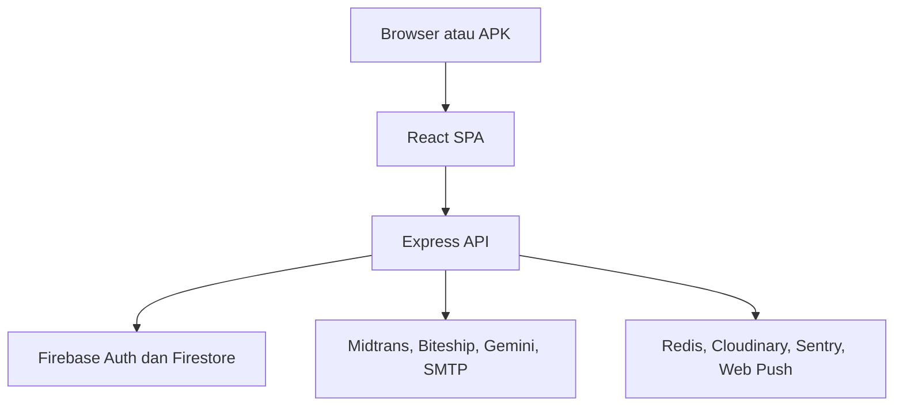

# Dokumentasi Lengkap Morgen Geschäft

Dokumen ini adalah sumber dokumentasi utama untuk project Morgen Geschäft. Isinya
mencakup gambaran produk, fitur pelanggan dan admin, arsitektur, instalasi,
konfigurasi, API, model data, keamanan, pengujian, deployment, operasi, serta
panduan kontribusi.

Dokumentasi ini disusun berdasarkan audit source pada 27 Agustus 2026. Jika
perilaku aplikasi dan dokumen berbeda, source code dan konfigurasi environment
yang sedang dijalankan adalah sumber kebenaran teknis.

## Daftar isi

1. [Tentang project](#1-tentang-project)
2. [Status audit](#2-status-audit)
3. [Fitur](#3-fitur)
4. [Arsitektur](#4-arsitektur)
5. [Struktur repository](#5-struktur-repository)
6. [Prasyarat](#6-prasyarat)
7. [Menjalankan project secara lokal](#7-menjalankan-project-secara-lokal)
8. [Konfigurasi environment](#8-konfigurasi-environment)
9. [Firebase dan akun admin](#9-firebase-dan-akun-admin)
10. [Panduan penggunaan pelanggan](#10-panduan-penggunaan-pelanggan)
11. [Panduan penggunaan admin](#11-panduan-penggunaan-admin)
12. [Integrasi layanan](#12-integrasi-layanan)
13. [Model data Firestore](#13-model-data-firestore)
14. [Referensi API](#14-referensi-api)
15. [Keamanan](#15-keamanan)
16. [Pengujian dan quality gate](#16-pengujian-dan-quality-gate)
17. [Build dan deployment](#17-build-dan-deployment)
18. [Distribusi APK](#18-distribusi-apk)
19. [Operasional, monitoring, dan backup](#19-operasional-monitoring-dan-backup)
20. [Troubleshooting](#20-troubleshooting)
21. [Kontribusi](#21-kontribusi)
22. [Batasan dan pekerjaan lanjutan](#22-batasan-dan-pekerjaan-lanjutan)
23. [Checklist sebelum open source](#23-checklist-sebelum-open-source)

---

## 1. Tentang project

Morgen Geschäft adalah storefront e-commerce bilingual untuk produk perawatan
diri. Project menyediakan website pelanggan, panel administrasi, API backend,
proses pembayaran, pengiriman, akun pelanggan, loyalty dan referral, konten,
notifikasi, chatbot, retur, serta dukungan distribusi aplikasi Android melalui
website.

### Sasaran pengguna

- Pelanggan yang berbelanja melalui website atau aplikasi Android.
- Admin toko yang mengelola produk, pesanan, promo, konten, pengiriman, dan
  layanan operasional.
- Developer dan contributor yang menjalankan, menguji, atau mengembangkan
  project.
- Operator deployment yang menjalankan aplikasi pada Node.js hosting, cPanel,
  atau VPS.

### Teknologi utama

| Lapisan                  | Teknologi                                                  |
| ------------------------ | ---------------------------------------------------------- |
| Frontend                 | React 18, Vite 5, React Router, Tailwind CSS, Lucide React |
| Backend                  | Node.js, Express 4                                         |
| Database dan autentikasi | Firebase Authentication, Cloud Firestore                   |
| Pembayaran               | Midtrans Snap dan webhook                                  |
| Pengiriman               | Biteship rate, tracking, dan webhook                       |
| AI customer service      | Gemini melalui GESA                                        |
| Cache/rate limit         | Upstash Redis REST dengan fallback memory                  |
| Upload gambar            | Cloudinary dengan fallback storage lokal                   |
| Email dan invoice        | SMTP, Nodemailer, PDFKit                                   |
| Push notification        | Web Push dan VAPID                                         |
| Monitoring               | Sentry frontend/backend dan health endpoint                |
| Test                     | Node Test Runner, Vitest, Testing Library                  |
| CI                       | GitHub Actions                                             |

### Bahasa dan URL

Bahasa yang didukung:

- Indonesia: /id
- English: /en

Rute publik memakai slug yang dilokalkan. Contoh:

| Fungsi               | Indonesia             | English                  |
| -------------------- | --------------------- | ------------------------ |
| Katalog              | /id/katalog           | /en/catalog              |
| Produk               | /id/produk/:id        | /en/product/:id          |
| Ulasan               | /id/ulasan            | /en/reviews              |
| Kuis tipe kulit      | /id/kuis-tipe-kulit   | /en/skin-type-quiz       |
| Artikel              | /id/artikel           | /en/articles             |
| Kebijakan privasi    | /id/kebijakan-privasi | /en/privacy-policy       |
| Syarat dan ketentuan | /id/syarat-ketentuan  | /en/terms-and-conditions |
| Unduh aplikasi       | /id/install           | /en/install              |

---

## 2. Status audit

Audit dilakukan terhadap source frontend, backend, Firebase rules/indexes,
skrip operasional, konfigurasi CI, dokumentasi lama, dan struktur artifact.

### Hasil verifikasi

| Pemeriksaan                 | Hasil                                                              |
| --------------------------- | ------------------------------------------------------------------ |
| Backend test                | 176 lulus                                                          |
| Frontend test               | 69 lulus                                                           |
| Total automated test        | 245 lulus                                                          |
| ESLint                      | Lulus dengan 18 warning dan 0 error                                |
| Build frontend production   | Berhasil                                                           |
| Firebase environment guard  | Berfungsi; build memerlukan konfigurasi publik Firebase            |
| Secret scan dasar           | Tidak menemukan secret nyata pada source yang diaudit              |
| Dependency audit production | Tidak ada critical; terdapat 6 moderate pada rantai firebase-admin |
| Feature flags               | Enam fitur tersedia dan aktif secara default                       |

Build menghasilkan peringatan ukuran chunk untuk bundle Firebase dan bundle
utama. Peringatan ini tidak menggagalkan build, tetapi menjadi kandidat optimasi
performa.

Lint sempat gagal saat dijalankan bersamaan dengan build karena Vite membuat dan
menghapus file konfigurasi sementara. Ketika dijalankan berurutan, lint selesai
dengan 18 warning dan 0 error. Warning utamanya adalah dependency React Hook dan
variable/import yang tidak dipakai.

Audit dependency tidak menemukan kerentanan critical, tetapi melaporkan enam
moderate pada dependency transitif firebase-admin. Perintah npm audit fix
--force menawarkan downgrade yang bersifat breaking; jangan menjalankannya tanpa
uji kompatibilitas dan review dependency.

### Temuan repository untuk open source

- Dokumentasi lama terpecah menjadi sembilan file dan beberapa informasi sudah
  tidak sesuai source terbaru.
- Roadmap lama menyatakan kuis tipe kulit dan flash sale belum tersedia, padahal
  keduanya sudah diimplementasikan.
- Dokumentasi deployment lama memuat path akun hosting dan nameserver production
  tertentu. Detail seperti ini tidak tepat untuk dokumentasi publik.
- Repository menggunakan MIT License melalui file LICENSE pada root project.
- Repository mempunyai README.md pada root sebagai halaman depan GitHub dan
  docs/README.md sebagai dokumentasi lengkap.
- ZIP hasil deployment, build lama, source map, log debug, dan artifact sementara
  masih ada di salinan project yang diaudit. File tersebut tidak boleh ikut
  commit publik.
- Source website menyediakan tautan APK, tetapi source aplikasi Android tidak
  berada dalam ZIP website ini.

### Arti status fitur

| Status            | Arti                                                                   |
| ----------------- | ---------------------------------------------------------------------- |
| Tersedia          | Alur dan kode fitur ada dalam source                                   |
| Perlu konfigurasi | Kode ada, tetapi membutuhkan layanan, secret, data, atau DNS eksternal |
| Parsial           | Sebagian alur ada atau masih membutuhkan proses manual                 |
| Belum tersedia    | Tidak ditemukan sebagai alur aktif pada source ini                     |

---

## 3. Fitur

### 3.1 Fitur pelanggan

| Fitur                         | Status            | Catatan                                                                     |
| ----------------------------- | ----------------- | --------------------------------------------------------------------------- |
| Beranda bilingual             | Tersedia          | Navigasi ID/EN dan section yang dilokalkan                                  |
| Katalog dan kategori          | Tersedia          | Face wash, body wash, sunscreen, serum, dan bundle                          |
| Pencarian/filter katalog      | Tersedia          | Mengikuti implementasi katalog frontend                                     |
| Detail produk                 | Tersedia          | Harga, stok, galeri, bahan aktif, deskripsi, dan rekomendasi                |
| Informasi kepatuhan produk    | Tersedia          | BPOM, isi bersih, batch, kedaluwarsa, dan peringatan tampil jika data diisi |
| Keranjang                     | Tersedia          | Ubah jumlah, hapus item, dan lanjut checkout                                |
| Wishlist                      | Tersedia          | Disimpan pada browser                                                       |
| Produk terakhir dilihat       | Tersedia          | Disimpan pada browser                                                       |
| Kupon                         | Tersedia          | Persen/nominal, minimum belanja, kedaluwarsa, dan single-use                |
| Flash sale terjadwal          | Tersedia          | Harga divalidasi kembali oleh backend                                       |
| Checkout tanpa akun           | Tersedia          | Nama, WhatsApp, email opsional, alamat, dan kurir                           |
| Akun pelanggan via OTP email  | Perlu konfigurasi | Memerlukan Firebase dan SMTP                                                |
| Alamat tersimpan              | Tersedia          | Maksimal lima alamat per akun                                               |
| Riwayat pesanan dan beli lagi | Tersedia          | Maksimal 50 pesanan terbaru pada akun                                       |
| Loyalty points                | Tersedia          | Aturan dihitung di backend                                                  |
| Referral                      | Tersedia          | Kode dan tautan undangan                                                    |
| Midtrans payment              | Perlu konfigurasi | Snap popup atau redirect                                                    |
| Ongkir dan tracking Biteship  | Perlu konfigurasi | Memerlukan API key dan pengaturan origin                                    |
| Lacak pesanan                 | Tersedia          | Memakai ID pesanan dan WhatsApp/token akses                                 |
| Pembatalan pesanan            | Tersedia          | Hanya ketika status masih memenuhi syarat                                   |
| Komplain dan retur            | Tersedia          | Form, foto bukti, tindak lanjut, resi retur, dan histori                    |
| Ulasan dan foto               | Tersedia          | Masuk moderasi admin; tombol membantu tersedia                              |
| Permintaan notifikasi stok    | Tersedia          | Email otomatis setelah stok dari 0 menjadi tersedia                         |
| Inbox notifikasi              | Tersedia          | Promo, pesanan, produk, artikel, ulasan, dan broadcast                      |
| Browser push                  | Perlu konfigurasi | Memerlukan VAPID dan izin pengguna                                          |
| Artikel                       | Tersedia          | Kategori, detail, versi ID/EN, dan jadwal terbit                            |
| FAQ                           | Tersedia          | Halaman publik bilingual                                                    |
| Kuis tipe kulit               | Tersedia          | Non-diagnostik, rekomendasi maksimal tiga produk                            |
| GESA chatbot                  | Perlu konfigurasi | Memerlukan Gemini API key                                                   |
| Privacy notice                | Tersedia          | Persetujuan analitik                                                        |
| Unduh APK                     | Tersedia          | Mengarah ke /download/morgen-geschaft-v1.0.0.apk                            |
| COD                           | Belum tersedia    | Checkout production masih menggunakan Midtrans                              |

### 3.2 Fitur admin

| Modul            | Kemampuan utama                                                                                                                                                                |
| ---------------- | ------------------------------------------------------------------------------------------------------------------------------------------------------------------------------ |
| Dashboard        | KPI periode, rentang tanggal khusus, pesanan terbaru, stok menipis, health layanan, dan feature flags                                                                          |
| Produk           | Tambah/edit, bilingual, upload gambar, galeri, harga, stok, kategori, bahan aktif, BPOM, batch, kedaluwarsa, peringatan, urutan, arsip, restore, hapus permanen, dan QR produk |
| Pesanan          | Filter status/tanggal/pembayaran/kurir, pencarian, ekspor CSV, invoice PDF, resi, catatan internal, status, dan histori                                                        |
| Komplain & retur | Review bukti, minta bukti tambahan, setujui/tolak, penggantian/refund, instruksi retur, penerimaan barang, penyelesaian, dan catatan risiko                                    |
| Pengiriman       | Memilih origin aktif dan melihat kurir/free-shipping yang dikonfigurasi                                                                                                        |
| Promo            | Kupon persen/nominal, minimum order, kedaluwarsa, single-use, status aktif, dan visibilitas publik                                                                             |
| Flash sale       | Buat, jadwalkan, edit, hentikan, dan pilih produk                                                                                                                              |
| Artikel          | Draft, preview, bilingual, kategori, tag, jadwal terbit, publish, dan hapus                                                                                                    |
| Ulasan           | Moderasi, filter rating/status, featured, verified purchase, sembunyikan, dan hapus                                                                                            |
| Notifikasi       | Broadcast web push dan inbox dalam bahasa ID/EN                                                                                                                                |
| Permintaan stok  | Daftar pelanggan yang menunggu dan status email terkirim                                                                                                                       |
| Pengaturan       | Backup JSON produk/kupon dan reset produk bawaan dengan konfirmasi                                                                                                             |
| Keamanan admin   | Firebase custom claim dan MFA/TOTP opsional atau wajib                                                                                                                         |

### 3.3 Feature flags

Feature flags disimpan pada settings/featureFlags dan dapat diubah dari
Dashboard admin tanpa deploy ulang.

| Flag             | Default | Dampak                               |
| ---------------- | ------- | ------------------------------------ |
| customerAccounts | true    | Akun pelanggan berbasis OTP          |
| loyalty          | true    | Poin pelanggan                       |
| referral         | true    | Referral dan reward                  |
| heroExperiment   | true    | Eksperimen hero dan funnel analytics |
| returns          | true    | Komplain dan retur                   |
| flashSale        | true    | Flash sale terjadwal                 |

Feature flag adalah alat rollback fitur, bukan pengganti pengujian atau migrasi
data.

---

## 4. Arsitektur

### 4.1 Gambaran sistem

Pada deployment satu domain, Express melayani API di /api dan file frontend
production dari folder public. Pada development, Vite dan Express berjalan pada
port berbeda dan Vite meneruskan request /api ke backend.

### 4.2 Alur checkout

1. Pelanggan memilih produk dan jumlah.
2. Frontend meminta area serta tarif pengiriman.
3. Backend mengambil harga/stok terbaru dari Firestore.
4. Backend memvalidasi kupon, poin, referral, flash sale, ongkir, dan total.
5. Backend membuat order serta request pembayaran Midtrans.
6. Pelanggan menyelesaikan pembayaran melalui Snap/redirect.
7. Webhook Midtrans diverifikasi dengan signature dan nominal order.
8. Status order, stok, reward, invoice, dan notifikasi diperbarui.
9. Webhook Biteship dapat memajukan status pengiriman tanpa menurunkan status
   yang sudah lebih lanjut.

### 4.3 Alur autentikasi

- Admin memakai Firebase email/password, custom claim admin: true, email
  terverifikasi, dan MFA bila REQUIRE_ADMIN_MFA aktif.
- Pelanggan meminta OTP email melalui backend.
- Setelah OTP valid, backend membuat sesi Firebase untuk akun pelanggan.
- Checkout tamu tetap didukung. Akses order tamu memakai token yang terikat pada
  order dan data pelanggan, bukan hanya ID yang mudah ditebak.

### 4.4 SEO

Frontend adalah SPA, bukan SSR penuh. Metadata rute disediakan oleh Express
untuk crawler:

- title, description, canonical, hreflang;
- Open Graph dan Twitter Card;
- metadata produk dan artikel;
- sitemap bilingual.

Jika menambah rute publik, perbarui frontend routing, route SEO backend, dan
sitemap secara bersamaan.

---

## 5. Struktur repository

    .
    ├── .github/
    │   ├── dependabot.yml
    │   └── workflows/ci.yml
    ├── backend/
    │   ├── app.js
    │   ├── scripts/
    │   ├── src/
    │   │   ├── config/
    │   │   ├── middleware/
    │   │   ├── routes/
    │   │   ├── services/
    │   │   └── utils/
    │   └── tests/
    ├── docs/
    │   └── README.md
    ├── firebase/
    │   ├── firestore.indexes.json
    │   └── firestore.rules
    ├── frontend/
    │   ├── config/
    │   ├── public/
    │   ├── scripts/
    │   ├── src/
    │   │   ├── components/
    │   │   ├── features/
    │   │   ├── hooks/
    │   │   ├── i18n/
    │   │   ├── pages/
    │   │   ├── services/
    │   │   └── utils/
    │   └── tests melalui file *.test.*
    ├── infra/
    │   └── scripts/
    ├── scripts/
    ├── firebase.json
    └── package.json

Folder penting:

- frontend/src/features berisi fitur per domain.
- backend/src/routes berisi HTTP endpoint.
- backend/src/services berisi logika bisnis dan integrasi.
- firebase berisi rules dan indexes yang harus di-deploy.
- infra berisi script backup dan monitoring operasional.
- backend/public adalah hasil build hosting dan tidak seharusnya menjadi sumber
  utama untuk perubahan frontend.

---

## 6. Prasyarat

Minimum untuk development:

- Node.js 22 LTS direkomendasikan.
- npm yang kompatibel dengan lockfile.
- Project Firebase dengan Authentication dan Firestore.
- Browser modern.

Untuk menjalankan seluruh integrasi:

- Akun Midtrans.
- Akun Biteship.
- Gemini API key.
- SMTP transaksional.
- Upstash Redis.
- Cloudinary.
- VAPID key.
- Sentry.

Layanan opsional boleh tidak dikonfigurasi ketika mengembangkan bagian yang
tidak bergantung padanya. Gunakan sandbox atau project terpisah untuk test.

---

## 7. Menjalankan project secara lokal

### 7.1 Instalasi

Dari root repository:

    npm ci

Salin file environment:

    copy frontend\.env.example frontend\.env.local
    copy backend\.env.example backend\.env

Pada Linux/macOS:

    cp frontend/.env.example frontend/.env.local
    cp backend/.env.example backend/.env

Isi nilai yang diperlukan. Jangan commit file .env atau .env.local.

### 7.2 Menjalankan frontend dan backend

Menjalankan keduanya:

    npm run dev:full

Menjalankan terpisah:

    npm run dev:frontend
    npm run dev:backend

Default yang direkomendasikan:

| Komponen      | URL                   |
| ------------- | --------------------- |
| Vite frontend | http://localhost:5173 |
| Express API   | http://localhost:3002 |

Contoh backend local:

    NODE_ENV=development
    PORT=3002
    ENFORCE_HTTPS=false
    TRUST_PROXY=loopback
    FRONTEND_URL=http://localhost:5173
    RATE_LIMIT_STORE=memory
    SERVE_FRONTEND=false

### 7.3 PM2 lokal

Jika backend sudah dijalankan dengan PM2, jangan menjalankan instance kedua pada
port yang sama.

    npm run backend:status
    npm run backend:restart
    npm run backend:logs

---

## 8. Konfigurasi environment

### 8.1 Frontend

Semua variable frontend masuk ke bundle browser. Jangan pernah menaruh server
key atau secret pada variable VITE_*.

| Variable                          | Kebutuhan   | Fungsi                                      |
| --------------------------------- | ----------- | ------------------------------------------- |
| VITE_API_BASE                     | Disarankan  | Base URL API; kosong untuk domain yang sama |
| VITE_MIDTRANS_CLIENT_KEY          | Kondisional | Client key publik Midtrans                  |
| VITE_MIDTRANS_IS_PRODUCTION       | Kondisional | Memilih Snap production/sandbox             |
| VITE_FIREBASE_API_KEY             | Wajib       | Firebase client config                      |
| VITE_FIREBASE_AUTH_DOMAIN         | Wajib       | Firebase Auth domain                        |
| VITE_FIREBASE_PROJECT_ID          | Wajib       | Firebase project ID                         |
| VITE_FIREBASE_STORAGE_BUCKET      | Opsional    | Firebase storage bucket                     |
| VITE_FIREBASE_MESSAGING_SENDER_ID | Opsional    | Firebase messaging sender                   |
| VITE_FIREBASE_APP_ID              | Wajib       | Firebase app ID                             |
| VITE_REQUIRE_ADMIN_MFA            | Kondisional | Menampilkan dan mewajibkan alur MFA admin   |
| VITE_SENTRY_DSN                   | Opsional    | Sentry browser                              |
| VITE_SENTRY_TRACES_SAMPLE_RATE    | Opsional    | Sampling tracing                            |
| SENTRY_AUTH_TOKEN                 | Build-only  | Upload source map; jangan masuk artifact    |
| SENTRY_ORG                        | Build-only  | Organisasi Sentry                           |
| SENTRY_PROJECT                    | Build-only  | Project Sentry                              |
| VITE_GA_ID                        | Opsional    | Google Analytics                            |
| VITE_META_PIXEL_ID                | Opsional    | Meta Pixel                                  |

### 8.2 Backend inti

| Variable                        | Kebutuhan            | Fungsi                              |
| ------------------------------- | -------------------- | ----------------------------------- |
| NODE_ENV                        | Wajib production     | development atau production         |
| PORT                            | Wajib                | Port Express                        |
| FRONTEND_URL                    | Wajib                | Origin CORS dan link email          |
| PUBLIC_SITE_URL                 | Disarankan           | Canonical, sitemap, dan link publik |
| SERVE_FRONTEND                  | Wajib satu domain    | Melayani folder public              |
| TRUST_PROXY                     | Wajib di balik proxy | Jumlah/lokasi proxy terpercaya      |
| ENFORCE_HTTPS                   | Wajib production     | Redirect HTTP ke HTTPS              |
| FIREBASE_SERVICE_ACCOUNT_BASE64 | Wajib                | Firebase Admin SDK                  |
| CUSTOMER_AUTH_SECRET            | Wajib                | OTP, referral, dan token order      |
| SHIPPING_QUOTE_SECRET           | Wajib                | Signature quote pengiriman          |

### 8.3 Pembayaran dan pengiriman

| Variable                | Kebutuhan      | Fungsi                                   |
| ----------------------- | -------------- | ---------------------------------------- |
| MIDTRANS_SERVER_KEY     | Wajib checkout | Server key Midtrans                      |
| MIDTRANS_IS_PRODUCTION  | Wajib          | Sandbox atau production                  |
| MIDTRANS_WEBHOOK_IPS    | Opsional       | Allowlist IP/CIDR selain signature       |
| PAYMENT_EXPIRY_MINUTES  | Opsional       | Kedaluwarsa pembayaran, default 15 menit |
| BITESHIP_API_KEY        | Wajib ongkir   | API Biteship                             |
| BITESHIP_WEBHOOK_SECRET | Wajib webhook  | Autentikasi webhook Biteship             |

### 8.4 AI, email, cache, dan media

| Variable                      | Kebutuhan             | Fungsi                               |
| ----------------------------- | --------------------- | ------------------------------------ |
| GEMINI_API_KEY                | Wajib GESA            | Gemini                               |
| SMTP_HOST                     | Wajib email           | Host SMTP                            |
| SMTP_PORT                     | Wajib email           | Port SMTP                            |
| SMTP_USER                     | Wajib email           | Username                             |
| SMTP_PASS                     | Wajib email           | Password/API key SMTP                |
| SMTP_FROM                     | Wajib email           | Identitas pengirim                   |
| ADMIN_NOTIFICATION_EMAIL      | Opsional              | Tujuan email admin                   |
| RATE_LIMIT_STORE              | Disarankan production | redis atau memory                    |
| RATE_LIMIT_CLUSTER_INSTANCES  | Kondisional           | Pembagi fallback memory pada cluster |
| UPSTASH_REDIS_REST_URL        | Wajib mode redis      | Endpoint Upstash                     |
| UPSTASH_REDIS_REST_TOKEN      | Wajib mode redis      | Token Upstash                        |
| UPSTASH_REDIS_REST_TIMEOUT_MS | Opsional              | Timeout koneksi                      |
| REDIS_RETRY_COOLDOWN_MS       | Opsional              | Jeda retry                           |
| RATE_LIMIT_REDIS_PREFIX       | Opsional              | Prefix key                           |
| CLOUDINARY_CLOUD_NAME         | Opsional              | Cloudinary                           |
| CLOUDINARY_API_KEY            | Opsional              | Cloudinary                           |
| CLOUDINARY_API_SECRET         | Opsional              | Cloudinary secret                    |
| UPLOAD_DIR                    | Opsional              | Fallback upload lokal                |

Ketiga variable Cloudinary harus dianggap satu paket. Jika tidak lengkap,
backend memakai fallback lokal.

### 8.5 Notifikasi dan observability

| Variable                        | Kebutuhan             | Fungsi                                |
| ------------------------------- | --------------------- | ------------------------------------- |
| VAPID_PUBLIC_KEY                | Opsional              | Web Push                              |
| VAPID_PRIVATE_KEY               | Opsional              | Web Push secret                       |
| SENTRY_DSN                      | Opsional              | Sentry backend                        |
| SENTRY_ENVIRONMENT              | Opsional              | Nama environment                      |
| SENTRY_RELEASE                  | Opsional              | Versi release                         |
| SENTRY_TRACES_SAMPLE_RATE       | Opsional              | Sampling tracing                      |
| STORE_WHATSAPP                  | Opsional              | Kontak customer service               |
| FONNTE_TOKEN                    | Opsional              | Notifikasi WhatsApp admin             |
| ADMIN_WHATSAPP                  | Opsional              | Nomor admin                           |
| INVOICE_LOGO_PATH               | Opsional              | Logo invoice lokal                    |
| INVOICE_LOGO_URL                | Opsional              | Logo invoice URL                      |
| FIRESTORE_BACKUP_RETENTION_DAYS | Opsional              | Retensi backup JSON                   |
| ABANDONED_CART_REMINDER_MINUTES | Opsional              | Jeda pengingat keranjang              |
| REQUIRE_ADMIN_MFA               | Disarankan production | Menolak sesi admin tanpa faktor kedua |

### 8.6 Aturan secret

- Commit hanya file .env.example.
- Jangan menaruh service-account JSON di repository.
- Jangan menyalin secret backend ke variable VITE_*.
- Jangan menaruh token dalam screenshot, issue, log, atau ZIP rilis.
- Rotasi secret yang pernah terpublikasi.
- Pisahkan key sandbox dan production.

---

## 9. Firebase dan akun admin

### 9.1 Firebase

1. Buat project Firebase.
2. Aktifkan Firestore.
3. Aktifkan Firebase Authentication.
4. Buat Web App dan salin client config ke frontend/.env.local.
5. Buat service account dan simpan sebagai base64 pada backend environment.
6. Deploy rules dan indexes:

       npm run firebase:login
       npm run firebase:status
       npm run firebase:deploy

7. Tunggu index berstatus Enabled sebelum menguji query.

### 9.2 Membuat admin

Buat user email/password melalui Firebase Authentication, verifikasi emailnya,
lalu berikan custom claim admin:

    npm run admin:grant -- admin@example.com

Mencabut akses:

    npm run admin:revoke -- admin@example.com

Perubahan custom claim biasanya memerlukan login ulang atau refresh token.

### 9.3 MFA/TOTP admin

Periksa kesiapan:

    npm run admin:mfa -- doctor admin@example.com

Aktifkan REQUIRE_ADMIN_MFA hanya setelah:

1. Identity Platform/TOTP sudah aktif.
2. Admin berhasil enrollment.
3. Login dengan faktor kedua berhasil.
4. Doctor menyatakan akun siap.

Jangan mengaktifkan kewajiban MFA sebelum minimal satu admin dapat login dengan
faktor kedua.

### 9.4 Firestore rules

Rules menerapkan pola berikut:

- data publik hanya dapat dibaca pada koleksi yang memang dibutuhkan storefront;
- perubahan produk, promo, artikel, order, dan pengaturan dibatasi untuk admin;
- data akun pelanggan dan token sensitif ditangani backend;
- fallback deny digunakan untuk path yang tidak didefinisikan.

Deploy rules dari source, jangan mengedit production tanpa menyimpan perubahan
kembali ke repository.

---

## 10. Panduan penggunaan pelanggan

### 10.1 Belanja

1. Buka katalog.
2. Pilih kategori atau produk.
3. Periksa deskripsi, stok, harga, bahan aktif, dan informasi kepatuhan.
4. Tambahkan produk ke keranjang.
5. Atur jumlah produk.
6. Pilih Checkout.
7. Masukkan kupon atau poin bila tersedia.
8. Masukkan data penerima dan alamat.
9. Cari kecamatan/kota dan pilih layanan kurir.
10. Periksa ringkasan.
11. Lanjutkan ke pembayaran Midtrans.

Harga, stok, kupon, flash sale, reward, dan ongkir divalidasi lagi oleh backend.
Nilai di browser bukan sumber kebenaran pembayaran.

### 10.2 Akun pelanggan

1. Buka menu akun.
2. Masukkan email.
3. Minta OTP.
4. Masukkan kode yang dikirim ke email.
5. Gunakan Ringkasan, Pesanan, Alamat, atau Reward.

Akun pelanggan tidak memakai password aplikasi. OTP harus dijaga seperti kode
login lain dan tidak boleh diberikan kepada pihak lain.

### 10.3 Lacak pesanan

1. Buka bagian Lacak Pesanan.
2. Masukkan ID order.
3. Masukkan nomor WhatsApp yang digunakan saat checkout bila diminta.
4. Lihat status pembayaran, proses toko, pengiriman, dan detail produk.
5. Gunakan pembatalan hanya jika tombol masih tersedia.

### 10.4 Komplain dan retur

1. Cari order yang telah diterima.
2. Buka Komplain & Retur dalam batas waktu yang ditampilkan.
3. Pilih produk dan jumlah bermasalah.
4. Pilih jenis masalah dan solusi yang diharapkan.
5. Tulis penjelasan.
6. Unggah 1–3 foto bukti.
7. Setujui kebijakan dan kirim.
8. Ikuti pesan admin.
9. Jangan mengirim barang sebelum pengajuan disetujui dan instruksi muncul.
10. Jika diminta, masukkan kurir serta resi retur.

Refund tidak otomatis. Admin tetap meninjau bukti dan mencatat referensi
penyelesaian.

### 10.5 Loyalty dan referral

Aturan default yang ditemukan pada source:

- memperoleh 1 poin per Rp10.000 belanja yang memenuhi syarat;
- nilai 1 poin adalah Rp100;
- minimum penukaran 10 poin;
- diskon poin dibatasi maksimal 20% subtotal produk;
- reward referral Rp10.000;
- minimum order referral Rp100.000.

Backend adalah sumber kebenaran. Admin dapat menonaktifkan loyalty atau referral
melalui feature flags.

### 10.6 Ulasan dan notifikasi stok

- Ulasan dapat menyertakan foto dan masuk moderasi sebelum tampil.
- Tombol Membantu mencatat respons pengguna dengan rate limit.
- Produk habis menyediakan permintaan notifikasi email.
- Email stok terkirim setelah admin mengubah stok dari 0 menjadi tersedia.

### 10.7 Kuis tipe kulit

Kuis memberi rekomendasi produk, bukan diagnosis. Hasil maksimal tiga produk dan
bergantung pada katalog yang tersedia. Jawaban tidak seharusnya disimpan tanpa
persetujuan pengguna.

---

## 11. Panduan penggunaan admin

### 11.1 Masuk

1. Buka dialog login admin.
2. Masukkan email dan password Firebase.
3. Selesaikan enrollment atau verifikasi TOTP jika diwajibkan.
4. Pastikan akun mempunyai custom claim admin dan email terverifikasi.

### 11.2 Dashboard

- Pilih periode cepat atau rentang tanggal khusus.
- Klik kartu KPI untuk masuk ke data terkait.
- Periksa pesanan terbaru dan stok menipis.
- Klik Perbarui pada Kesehatan Sistem.
- Gunakan feature flags hanya untuk rollback fitur yang sudah dipahami
  dampaknya.

### 11.3 Produk

- Isi versi Indonesia dan English.
- Unggah foto utama dan foto tambahan.
- Isi harga, stok, kategori, bahan aktif, dan harga pembanding bila perlu.
- Isi BPOM dan isi bersih dari sumber resmi.
- Isi batch/kedaluwarsa berdasarkan stok fisik atau gunakan informasi generik
  yang benar seperti “lihat kemasan”; jangan mengarang nomor batch/tanggal.
- Gunakan arsip untuk menyembunyikan produk tanpa kehilangan histori.
- Hapus permanen hanya setelah memastikan produk tidak dibutuhkan oleh histori.
- Gunakan QR produk untuk tautan langsung.

### 11.4 Pesanan

- Filter berdasarkan status, periode, pembayaran, atau kurir.
- Cari berdasarkan ID, nama, telepon, atau email.
- Ekspor hasil filter sebagai CSV.
- Buka/cetak invoice PDF.
- Simpan nomor resi untuk mengubah order ke status dikirim.
- Gunakan catatan internal untuk informasi yang tidak ditampilkan ke pelanggan.
- Jangan memundurkan status terminal atau status pembayaran secara manual.

### 11.5 Komplain dan retur

- Tinjau order, bukti, item, dan histori.
- Minta bukti tambahan bila informasi belum cukup.
- Pilih penggantian atau refund saat menyetujui.
- Tulis alasan/pesan pelanggan pada penolakan atau permintaan bukti.
- Isi instruksi dan alamat retur sebelum meminta barang dikirim.
- Konfirmasi barang diterima.
- Catat referensi refund atau resi penggantian sebelum menyelesaikan.
- Tanda risiko hanya untuk pola penyalahgunaan yang jelas, bukan keputusan
  otomatis.

### 11.6 Pengiriman

Pengaturan origin dibaca dari settings/shipping. Admin dapat memilih origin yang
sudah disiapkan. Daftar origin, prefix free shipping, alamat pickup, dan kurir
utama perlu dibuat pada Firestore/configuration terlebih dahulu.

### 11.7 Promo dan flash sale

- Kupon dapat berupa persen atau nominal.
- Tetapkan minimum order dan tanggal kedaluwarsa.
- Single-use membutuhkan identitas pelanggan yang dapat dibuktikan.
- Flash sale membutuhkan judul ID/EN, waktu mulai/akhir, diskon, dan produk.
- Backend menolak jadwal yang bentrok atau diskon tidak aman.

### 11.8 Artikel

- Simpan draft untuk konten yang belum siap.
- Gunakan preview.
- Isi konten ID dan EN.
- Pilih kategori, tag, cover, tanggal, waktu baca, dan waktu terbit.
- Waktu terbit di masa depan menjadi artikel terjadwal.

### 11.9 Ulasan, notifikasi, dan stok

- Tampilkan atau sembunyikan ulasan setelah moderasi.
- Featured memilih ulasan yang diprioritaskan.
- Verified purchase harus berdasarkan bukti transaksi.
- Broadcast dapat mempunyai judul, isi, dan URL berbeda untuk ID/EN.
- Pantau daftar permintaan stok dan status pengiriman email.

### 11.10 Pengaturan

- Unduh backup JSON sebelum perubahan massal.
- Reset produk bawaan mengarsipkan produk tambahan; fitur ini tetap berisiko dan
  membutuhkan teks konfirmasi RESET.
- Backup JSON dari panel bukan pengganti backup Firestore penuh.

---

## 12. Integrasi layanan

### 12.1 Midtrans

- Frontend memakai client key publik.
- Backend memakai server key rahasia.
- Backend menghitung ulang total.
- Webhook memverifikasi SHA-512 signature.
- Nominal webhook harus cocok dengan nominal order.
- Order terminal tidak boleh “hidup kembali” karena webhook terlambat.

Callback:

    POST /api/midtrans-notification

Jangan menerapkan cache atau browser challenge pada endpoint ini.

### 12.2 Biteship

Dipakai untuk pencarian area, tarif, tracking, dan status pengiriman.

Webhook:

    POST /api/biteship-webhook

Gunakan BITESHIP_WEBHOOK_SECRET yang panjang dan unik. Quote ongkir juga
ditandatangani agar tujuan atau isi keranjang tidak dapat diubah setelah quote.

### 12.3 GESA dan Gemini

Prompt GESA dibangun dari:

1. produk dan kupon aktif di Firestore;
2. pengetahuan statis pada backend/src/services/gesaKnowledge.js;
3. dokumen aktif pada koleksi gesa_knowledge.

Schema pengetahuan dinamis:

| Field      | Wajib | Fungsi               |
| ---------- | ----- | -------------------- |
| question   | Ya    | Pertanyaan Indonesia |
| answer     | Ya    | Jawaban Indonesia    |
| questionEn | Tidak | Pertanyaan English   |
| answerEn   | Tidak | Jawaban English      |
| active     | Tidak | Default aktif        |
| order      | Tidak | Urutan               |

Prompt di-cache sekitar lima menit. Restart backend atau tunggu cache berakhir
setelah perubahan. Jawaban sebaiknya singkat, tidak membuat klaim medis, dan
mengeskalasi refund/komplain sensitif ke customer service.

### 12.4 SMTP

SMTP dipakai untuk OTP, invoice, notifikasi order, permintaan stok, dan pengingat
keranjang.

Rekomendasi:

- gunakan provider email transaksional;
- gunakan alamat pengirim pada domain sendiri;
- pasang SPF, DKIM, dan DMARC;
- gunakan satu record SPF yang valid;
- jangan proxy record mail/MX melalui CDN.

### 12.5 Cloudinary

Upload admin dan foto ulasan mencoba Cloudinary lebih dahulu. Jika koneksi tidak
tersedia, backend dapat memakai storage lokal. Validasi membatasi tipe gambar,
magic bytes, lokasi upload, dan URL yang diizinkan.

### 12.6 Redis

Production sebaiknya memakai RATE_LIMIT_STORE=redis agar rate limit konsisten
antar instance. Mode memory sesuai untuk development satu proses, tetapi tidak
ideal untuk cluster.

### 12.7 Web Push

Generate VAPID key:

    npx web-push generate-vapid-keys

Simpan private key hanya di backend. Browser tetap meminta izin pengguna.

### 12.8 Sentry dan analytics

- Sentry frontend menerima error browser.
- Sentry backend menerima error server dan tracing.
- Source map dapat diunggah saat build memakai token build-only.
- Google Analytics dan Meta Pixel hanya diaktifkan setelah consent sesuai
  implementasi privacy notice.

---

## 13. Model data Firestore

Koleksi utama yang ditemukan:

| Koleksi                | Isi                                                           |
| ---------------------- | ------------------------------------------------------------- |
| products               | Produk, stok, harga, konten bilingual, kepatuhan, dan urutan  |
| coupons                | Kupon                                                         |
| couponClaims           | Pemakaian kupon single-use                                    |
| orders                 | Order, pelanggan, pembayaran, pengiriman, status, dan histori |
| checkoutRequests       | Idempotency checkout                                          |
| customerProfiles       | Profil, alamat, poin, referral                                |
| customerOtpChallenges  | Challenge OTP sementara                                       |
| referralCodes          | Pemetaan kode referral                                        |
| rewardTransactions     | Ledger poin/reward                                            |
| returnRequests         | Komplain, bukti, keputusan, shipment, dan histori             |
| customerRiskProfiles   | Catatan risiko internal retur                                 |
| testimoni              | Ulasan pelanggan dan moderasi                                 |
| blogs                  | Artikel ID/EN                                                 |
| flashSales             | Jadwal dan produk flash sale                                  |
| notifications          | Inbox notifikasi                                              |
| push_subscriptions     | Subscription Web Push                                         |
| stock_notifications    | Permintaan notifikasi stok                                    |
| settings               | Shipping dan feature flags                                    |
| gesa_knowledge         | Pengetahuan dinamis GESA                                      |
| funnelAnalytics        | Agregasi eksperimen/funnel                                    |
| abuse_logs             | Catatan rate limit/abuse                                      |
| admins dan adminConfig | Konfigurasi admin                                             |
| _meta                  | Metadata proses terjadwal/operasional                         |

### Prinsip perubahan schema

- Tambahkan normalisasi dan validasi backend.
- Perbarui Firestore rules.
- Tambahkan index bila query baru membutuhkannya.
- Tambahkan test.
- Dokumentasikan field baru.
- Uji dengan data lama yang mungkin belum mempunyai field tersebut.

---

## 14. Referensi API

Daftar berikut adalah ringkasan endpoint utama, bukan kontrak OpenAPI formal.

### 14.1 Publik dan pelanggan

| Method | Endpoint                                  | Fungsi                        |
| ------ | ----------------------------------------- | ----------------------------- |
| GET    | /api/products                             | Produk publik                 |
| GET    | /api/testimoni                            | Ulasan publik                 |
| GET    | /api/promotions                           | Promo publik                  |
| GET    | /api/blogs                                | Artikel publik                |
| GET    | /api/feature-flags                        | Feature flags                 |
| GET    | /api/flash-sales/current                  | Flash sale aktif              |
| POST   | /api/coupons/validate                     | Validasi kupon                |
| POST   | /api/validate-stock                       | Validasi stok                 |
| POST   | /api/create-transaction                   | Membuat order dan pembayaran  |
| POST   | /api/orders/lookup                        | Lacak order                   |
| POST   | /api/orders/:orderId/cancel               | Pembatalan order              |
| POST   | /api/orders/:orderId/payment-expire-check | Sinkronisasi kedaluwarsa      |
| GET    | /api/shipping/areas                       | Cari area                     |
| POST   | /api/shipping/rates                       | Tarif pengiriman              |
| GET    | /api/shipping/track                       | Tracking                      |
| POST   | /api/customer-auth/request-otp            | Minta OTP                     |
| POST   | /api/customer-auth/verify-otp             | Verifikasi OTP                |
| GET    | /api/customer/account                     | Akun pelanggan terautentikasi |
| PATCH  | /api/customer/account/addresses           | Simpan alamat                 |
| GET    | /api/customer/notifications               | Notifikasi akun               |
| POST   | /api/notify-stock                         | Permintaan stok               |
| POST   | /api/testimoni                            | Kirim ulasan                  |
| POST   | /api/testimoni/photo                      | Upload foto ulasan            |
| POST   | /api/testimoni/:id/helpful                | Tandai membantu               |
| POST   | /api/chat                                 | GESA                          |
| POST   | /api/push/subscribe                       | Subscription push             |
| GET    | /api/push/vapid-key                       | Public VAPID key              |
| GET    | /api/health                               | Health proses publik          |

Endpoint retur mencakup pembuatan pengajuan, respons/bukti lanjutan, dan shipment
retur di bawah /api/returns.

### 14.2 Admin

Semua endpoint admin memerlukan Firebase bearer token dan custom claim admin.

| Method | Endpoint                       | Fungsi                      |
| ------ | ------------------------------ | --------------------------- |
| GET    | /api/orders                    | Daftar order                |
| PATCH  | /api/orders/:orderId           | Perbarui order              |
| GET    | /api/orders/:orderId/invoice   | Invoice PDF                 |
| PATCH  | /api/products/:productId       | Perbarui stok/data tertentu |
| GET    | /api/stock-notifications       | Permintaan stok             |
| POST   | /api/upload                    | Upload gambar               |
| GET    | /api/admin/returns             | Daftar retur                |
| PATCH  | /api/admin/returns/:orderId    | Workflow retur              |
| GET    | /api/shipping/settings         | Pengaturan shipping         |
| PATCH  | /api/shipping/settings         | Ganti origin                |
| GET    | /api/admin/flash-sales         | Daftar flash sale           |
| POST   | /api/admin/flash-sales         | Buat flash sale             |
| PATCH  | /api/admin/flash-sales/:saleId | Edit/hentikan               |
| POST   | /api/push/broadcast            | Broadcast                   |
| DELETE | /api/notifications             | Hapus notifikasi            |
| GET    | /api/admin/analytics/funnel    | Analitik funnel             |
| PATCH  | /api/admin/feature-flags       | Feature flags               |
| GET    | /api/admin/health              | Health seluruh dependency   |

### 14.3 Webhook

| Method | Endpoint                   | Perlindungan                                           |
| ------ | -------------------------- | ------------------------------------------------------ |
| POST   | /api/midtrans-notification | Signature, amount match, rate limit, status transition |
| POST   | /api/biteship-webhook      | Secret token, payload validation, rate limit           |

### 14.4 Format error

Client tidak boleh bergantung pada teks error sebagai identifier stabil. Jika
menambah API baru, gunakan status HTTP tepat dan pertimbangkan error code yang
stabil.

---

## 15. Keamanan

Kontrol yang ditemukan pada source:

- Helmet dan Content Security Policy.
- CORS berbasis FRONTEND_URL.
- Redirect HTTPS yang dapat dikontrol environment.
- Trust proxy eksplisit.
- Rate limiter terpisah untuk endpoint sensitif.
- Redis untuk konsistensi multi-instance.
- Firebase Admin lazy initialization.
- Firebase custom claim untuk admin.
- Email verified dan faktor kedua untuk mode MFA.
- OTP pelanggan dengan challenge dan secret backend.
- ID order acak non-sekuensial dan access token berbasis purpose.
- Idempotency checkout.
- Perhitungan harga, stok, promo, flash sale, poin, dan ongkir di backend.
- Signature dan amount verification webhook Midtrans.
- Secret webhook Biteship.
- Signed shipping quote.
- Validasi MIME dan magic bytes upload.
- Sanitasi teks dan pembatasan panjang input.
- Pembatasan URL upload Cloudinary.
- Firestore rules dengan deny fallback.
- Sentry tanpa mengekspos secret.

### Checklist keamanan production

- Gunakan HTTPS end-to-end.
- Pisahkan sandbox dan production.
- Gunakan Redis pada deployment multi-instance.
- Aktifkan MFA admin setelah enrollment diuji.
- Terapkan least privilege pada service account.
- Batasi CORS ke domain resmi.
- Jangan cache /api, webhook, login, atau panel admin.
- Uji restore backup.
- Audit dependency rutin.
- Hapus source map dari public setelah upload ke Sentry.
- Jangan commit artifact yang dapat berisi konfigurasi build.
- Tinjau log tanpa menyimpan OTP, token, alamat lengkap, atau secret.

---

## 16. Pengujian dan quality gate

### 16.1 Perintah utama

Jalankan secara berurutan:

    npm ci
    npm run lint
    npm run test:backend
    npm run test:frontend
    npm run build

Semua test:

    npm test

Format:

    npm run format:check

Audit dependency production:

    npm audit --omit=dev --audit-level=critical

Audit file sensitif:

    npm run privacy:audit

### 16.2 Cakupan test saat audit

Backend mencakup antara lain:

- pricing, kupon, dan total;
- webhook Midtrans;
- idempotency dan item normalization;
- upload dan Cloudinary;
- CSP;
- loyalty/referral;
- flash sale;
- public blog filter;
- return eligibility/workflow;
- token order;
- admin claim/MFA;
- shipping quote dan webhook;
- SMTP.

Frontend mencakup antara lain:

- locale dan route;
- notification baseline;
- kuis tipe kulit;
- analytics;
- Firebase auth;
- return panel;
- flash sale UI;
- hero;
- payment storage;
- referral/loyalty;
- public content.

### 16.3 CI

GitHub Actions menjalankan:

- lint;
- npm audit critical untuk dependency production;
- backend tests;
- frontend tests;
- frontend production build dengan Firebase dummy.

CI tidak menggantikan test integrasi dengan Midtrans, Biteship, SMTP, Firebase,
atau browser production.

### 16.4 Smoke test production

    npm run verify:production

Pemeriksaan manual minimum:

- /id dan /en;
- /api/health;
- katalog dan detail produk;
- login admin;
- health admin;
- checkout sandbox/transaksi kecil;
- callback Midtrans;
- ongkir/tracking;
- email invoice;
- upload gambar;
- lacak order;
- retur;
- APK URL.

---

## 17. Build dan deployment

### 17.1 Build frontend

    npm run build

Hasil berada pada frontend/dist.

Build hosting yang menyalin hasil ke backend/public:

    npm run build:hosting

Membuat ZIP public pada Windows:

    npm run zip:public

Jangan commit dist, backend/public, source map, atau ZIP deployment.

### 17.2 Model deployment satu domain

Contoh struktur server:

    <application-root>/
    ├── app.js
    ├── package.json
    ├── package-lock.json
    ├── src/
    ├── public/
    └── storage/uploads/

Pemetaan:

| Lokal                                 | Server                           |
| ------------------------------------- | -------------------------------- |
| backend/app.js                        | application root/app.js          |
| backend/src                           | application root/src             |
| backend/package*.json                 | application root                 |
| isi backend/public atau frontend/dist | application root/public          |
| backend/storage/uploads               | application root/storage/uploads |

Environment production minimum:

    NODE_ENV=production
    PORT=<port-hosting>
    SERVE_FRONTEND=true
    FRONTEND_URL=https://example.com
    PUBLIC_SITE_URL=https://example.com
    TRUST_PROXY=1
    ENFORCE_HTTPS=true
    MIDTRANS_IS_PRODUCTION=true
    RATE_LIMIT_STORE=redis

### 17.3 cPanel/Passenger

Pada hosting yang membutuhkan wrapper CommonJS untuk memuat ES module, gunakan
startup wrapper:

    (async () => {
      try {
        await import("./app.js");
      } catch (error) {
        console.error(error);
        process.exit(1);
      }
    })();

Nama file wrapper dan application root mengikuti provider hosting. Jangan
menyalin path akun milik deployment lain.

### 17.4 Jenis deployment

| Perubahan                     | Upload                  | Install dependency | Restart        |
| ----------------------------- | ----------------------- | ------------------ | -------------- |
| Frontend saja                 | isi public/dist         | Tidak              | Biasanya tidak |
| Backend tanpa package change  | file backend berubah    | Tidak              | Ya             |
| Backend dengan package change | source dan package lock | Ya                 | Ya             |
| Firestore rules/indexes       | deploy Firebase         | Tidak              | Tidak          |

Simpan versi sebelumnya untuk rollback. Jangan menimpa atau menghapus
storage/uploads, environment, dan startup wrapper.

### 17.5 Reverse proxy/CDN

- Gunakan TLS strict.
- Jangan memakai flexible SSL.
- Bypass cache untuk /api/*.
- Jangan memberi browser challenge pada webhook.
- Record email/MX harus DNS only bila memakai Cloudflare.
- Root dan www dapat diproxy sesuai arsitektur.

### 17.6 Rollback

1. Pulihkan file rilis sebelumnya.
2. Pulihkan package dan lockfile bila dependency berubah.
3. Jalankan install hanya bila package berubah.
4. Restart backend.
5. Jalankan smoke test lagi.
6. Jangan mengubah data order secara manual untuk “menyamakan” kode lama.

### 17.7 Source yang di-push ke GitHub

File dan folder yang masuk repository:

| Masuk GitHub                             | Tidak masuk GitHub                       |
| ---------------------------------------- | ---------------------------------------- |
| README.md, LICENSE, docs                 | File .env dan secret                     |
| assets                                   | node_modules                             |
| frontend source dan public assets        | frontend/dist                            |
| backend source, tests, dan package files | backend/public                           |
| firebase rules dan indexes               | storage runtime dan upload pelanggan     |
| scripts dan infra operasional            | log dan backup                           |
| .github workflows                        | ZIP deployment, APK, dan AAB             |
| konfigurasi root dan lockfile            | service-account JSON dan data production |

Gunakan .gitignore sebagai perlindungan pertama, kemudian periksa git status
sebelum setiap commit. File yang pernah terlanjur masuk riwayat Git tidak hilang
hanya karena ditambahkan ke .gitignore; hapus dari riwayat dan rotasi secret
yang pernah terpublikasi.

---

## 18. Distribusi APK

Website mengarahkan tombol download ke:

    /download/morgen-geschaft-v1.0.0.apk

Untuk mengganti versi:

1. Build signed release APK dari project Android.
2. Pertahankan keystore/package ID agar update dapat dipasang di atas versi lama.
3. Ubah nama file dengan versi yang jelas.
4. Upload APK ke folder public/download.
5. Perbarui ANDROID_APK_URL pada frontend/src/pages/StaticPages.jsx.
6. Build frontend.
7. Deploy frontend.
8. Uji URL APK pada perangkat Android.

Browser tidak boleh memasang APK tanpa konfirmasi Android. Satu klik dari website
dapat mengunduh atau membuka file, tetapi pengguna tetap menyetujui izin sumber
dan pemasangan.

Perubahan data seperti produk, harga, stok, promo, dan pesanan dapat terlihat
oleh aplikasi jika APK memakai API yang sama. Perubahan UI/kode native selalu
memerlukan build APK baru.

Source APK tidak termasuk dalam repository website yang diaudit. Jika APK juga
akan di-open-source, gunakan repository atau workspace terpisah dan dokumentasi
versi yang selaras.

---

## 19. Operasional, monitoring, dan backup

### 19.1 Health

Publik:

    GET /api/health

Admin:

    GET /api/admin/health

Health admin memeriksa Firestore, Midtrans, Biteship, Gemini, SMTP, Redis,
Sentry, dan Cloudinary. Status configured/ready tidak selalu membuktikan alur
bisnis end-to-end; tetap lakukan transaksi dan upload uji.

### 19.2 Monitoring

- Gunakan uptime monitor pada /api/health.
- Pantau Sentry.
- Pantau log backend setelah rilis.
- Pantau transaksi pertama setelah perubahan checkout.
- Jalankan:

      npm run monitor:storefront
      npm run logs:audit

### 19.3 Backup Firestore

Backup JSON backend:

    npm run backup:firestore -w backend

Script export terjadwal tersedia pada infra/scripts. Backup production idealnya
memakai export Firestore ke Cloud Storage dan disalin ke lokasi terpisah.

Prinsip backup:

- backup harus otomatis;
- retention harus ditentukan;
- hasil backup harus dipantau;
- restore harus diuji pada environment terpisah;
- backup tidak boleh ikut repository publik.

### 19.4 Email health

Setelah perubahan SMTP/DNS:

1. periksa admin health;
2. minta OTP uji;
3. buat transaksi sandbox/kecil;
4. periksa invoice;
5. periksa SPF, DKIM, dan DMARC;
6. tinjau spam/bounce provider.

---

## 20. Troubleshooting

| Gejala                            | Kemungkinan                                        | Tindakan                                                                |
| --------------------------------- | -------------------------------------------------- | ----------------------------------------------------------------------- |
| Firebase config error saat build  | .env.local belum lengkap                           | Isi VITE_FIREBASE_*                                                     |
| Frontend lama tetap tampil        | index.html atau assets lama, cache/service worker  | Pastikan hasil dist terbaru di-upload dan buka Incognito                |
| URL APK tidak ditemukan di bundle | Source belum tertimpa atau build dari folder salah | Cari URL pada source, build ulang, lalu cari pada dist/assets           |
| API 500 setelah update            | Env/dependency/source tidak lengkap                | Periksa log dan health; install hanya jika package berubah              |
| Too many redirects                | TLS/proxy/ENFORCE_HTTPS tidak selaras              | Gunakan TLS strict dan TRUST_PROXY yang benar                           |
| Admin login ditolak               | Claim, verified email, atau MFA belum valid        | Jalankan admin:mfa doctor dan refresh token                             |
| OTP tidak masuk                   | SMTP/DNS/rate limit                                | Periksa admin health dan log provider                                   |
| Ongkir tidak tampil               | Biteship key, origin, area, atau quote             | Periksa settings/shipping dan backend log                               |
| Callback tidak mengubah order     | URL, signature, cache/challenge                    | Periksa dashboard provider dan pengecualian CDN                         |
| Cloudinary ready tetapi URL lokal | Upload Cloudinary gagal lalu fallback              | Periksa tiga env dan log                                                |
| Notifikasi push tidak muncul      | Izin browser atau VAPID                            | Periksa permission, subscription, dan HTTPS                             |
| NPROC hosting penuh               | Instance Passenger/thread atau proses akun         | Hentikan app, tutup terminal, lalu minta provider memeriksa proses akun |
| Lint gagal saat build bersamaan   | File sementara Vite berubah                        | Jalankan lint dan build berurutan                                       |
| Chunk size warning                | Bundle besar                                       | Tambah code splitting/manual chunks; bukan build failure                |

---

## 21. Kontribusi

### 21.1 Workflow

1. Fork repository.
2. Buat branch dari main.
3. Instal dengan npm ci.
4. Buat perubahan kecil dan fokus.
5. Tambahkan/perbarui test.
6. Jalankan lint, test, build, dan privacy audit.
7. Jangan sertakan secret, data pelanggan, log, build, atau ZIP.
8. Buat pull request dengan penjelasan dampak dan cara verifikasi.

### 21.2 Konvensi

- Gunakan ES module.
- Pertahankan struktur feature-based frontend.
- Letakkan validasi dan sumber kebenaran transaksi di backend.
- Jangan mempercayai harga, ongkir, atau role dari client.
- Tambahkan teks ID dan EN untuk UI publik baru.
- Gunakan route lokal yang konsisten.
- Jaga aksesibilitas modal, tombol, label, fokus, dan keyboard.
- Gunakan logger, bukan console berisi data sensitif.
- Tambahkan migration strategy untuk perubahan data.

### 21.3 Pull request checklist

- [ ] Tidak ada secret/data pelanggan.
- [ ] Lint lulus.
- [ ] Backend test lulus.
- [ ] Frontend test lulus.
- [ ] Build lulus.
- [ ] Firestore rules/index diperbarui bila perlu.
- [ ] Dokumentasi tunggal ini diperbarui.
- [ ] UI diuji desktop dan mobile.
- [ ] Alur ID dan EN diuji.
- [ ] Dampak keamanan dan rollback dijelaskan.

---

## 22. Batasan dan pekerjaan lanjutan

### Belum tersedia

- COD.
- OpenAPI schema formal.
- Source Android dalam repository website.

### Perlu penyempurnaan

- Optimasi bundle besar melalui code splitting lebih lanjut.
- Hilangkan artifact build/ZIP/log dari repository sebelum publikasi.
- Generalisasi domain hard-coded pada SEO, robots, email fallback, dan skrip
  verifikasi agar fork dapat memakai domain lain tanpa pencarian manual.
- Generalisasi nama brand bila project ditujukan menjadi engine e-commerce yang
  dapat dipakai ulang.
- Tambahkan test integrasi provider pada environment sandbox.
- Tambahkan schema validation terpusat untuk request API.
- Dokumentasikan versi/migrasi data bila project mulai menerima contributor.
- Buat admin UI untuk gesa_knowledge bila pengelolaan melalui Firestore Console
  dianggap terlalu teknis.

### Data yang wajib diisi operator

Fitur dapat ada di kode tetapi tidak tampil bila datanya kosong. Contoh:

- BPOM, batch, kedaluwarsa, dan peringatan produk;
- artikel English;
- kupon publik;
- shipping origin/free-shipping;
- pengetahuan GESA;
- key provider eksternal;
- APK pada public/download.

---

## 23. Checklist sebelum open source

### Wajib

- [x] MIT License tersedia pada root repository.
- [ ] Hapus .env, service account, token, credential, dan backup.
- [ ] Hapus firestore-debug.log dan seluruh *.log.
- [ ] Hapus public-update.zip dan ZIP deployment lain.
- [ ] Hapus backend/public dan frontend/dist dari commit.
- [ ] Hapus source map dari artifact publik.
- [ ] Hapus data pelanggan dan contoh order nyata.
- [ ] Ganti path akun hosting, email pribadi, nomor WhatsApp, dan detail DNS
      pribadi dengan placeholder.
- [ ] Jalankan npm run privacy:audit.
- [ ] Jalankan npm audit --omit=dev --audit-level=critical.
- [ ] Jalankan seluruh lint, test, dan build secara berurutan.
- [ ] Periksa riwayat Git; menghapus file dari commit terakhir tidak menghapus
      secret dari commit lama.
- [ ] Rotasi semua secret yang pernah masuk Git atau dibagikan.

### Disarankan

- [ ] Tambahkan SECURITY.md.
- [ ] Tambahkan CODE_OF_CONDUCT.md.
- [ ] Tambahkan template issue dan pull request.
- [ ] Aktifkan Dependabot dan branch protection.
- [ ] Tetapkan dukungan versi Node.
- [ ] Tambahkan release/tag dan changelog.
- [ ] Pisahkan dokumentasi deployment pribadi dari repository publik.

---

## Lisensi

Project ini dirilis menggunakan **MIT License**. Source boleh digunakan,
dipelajari, dimodifikasi, dan didistribusikan, termasuk untuk penggunaan
komersial, dengan tetap menyertakan pemberitahuan hak cipta dan lisensi.

Teks lengkap tersedia pada file [LICENSE](../LICENSE).
